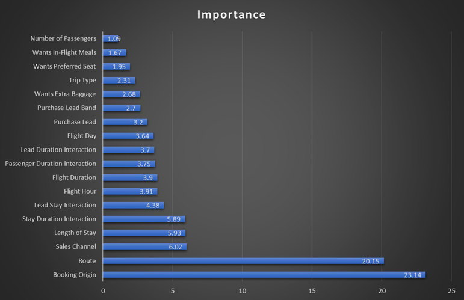

# British Airways Data Analytics Simulations ✈️

Data analytics and machine learning projects completed as part of the British Airways Forage job simulations.

The work covers two separate business problems:

1. **Lounge eligibility forecasting** — estimating the proportion of passengers eligible for different lounge tiers using scalable flight groupings.
2. **Customer booking prediction** — predicting whether a customer would complete a booking and identifying the variables contributing most strongly to the prediction.

---

## 1. Lounge Eligibility Forecasting

### Objective

Estimate the percentage of passengers eligible for:

- **Tier 1:** Concorde Room
- **Tier 2:** First Lounge
- **Tier 3:** Club Lounge

The objective was to create a **generalised lookup table** that could be applied to future flight schedules rather than making predictions for individual flights.

### Data

The dataset contained flight-level information including:

- Flight date
- Flight time
- Time of day
- Airline
- Flight number
- Departure station
- Arrival station
- Arrival country
- Arrival region
- Haul type
- Aircraft type
- First class seats
- Business class seats
- Economy seats
- Tier 1 eligible passengers
- Tier 2 eligible passengers
- Tier 3 eligible passengers

### Approach

Several grouping strategies were tested using:

- `TIME_OF_DAY`
- `HAUL`
- `ARRIVAL_REGION`
- Combinations of these variables

The eligibility percentage for each tier was calculated within each grouping and evaluated using **Mean Absolute Error (MAE)**.

### Grouping Evaluation

| Grouping | Tier 1 MAE | Tier 2 MAE | Tier 3 MAE | Average MAE |
|---|---:|---:|---:|---:|
| Arrival Region + Time of Day | 0.363 | 2.041 | 6.085 | 2.829 |
| Haul + Arrival Region + Time of Day | 0.363 | 2.041 | 6.085 | 2.829 |
| Haul + Time of Day | 0.363 | 2.041 | 6.086 | 2.830 |
| Arrival Region | 0.363 | 2.040 | 6.087 | 2.830 |
| Haul + Arrival Region | 0.363 | 2.040 | 6.087 | 2.830 |
| Haul | 0.363 | 2.041 | 6.088 | 2.831 |
| Time of Day | 0.366 | 2.144 | 6.588 | 3.033 |

### Feature / Grouping Decisions

**Flight number** was removed because the dataset contained 6,037 unique flight numbers. Using flight number would make the lookup table overly specific and difficult to apply to future schedules.

**Flight time** was removed because time-of-day categories provided a more generalised representation of departure timing.

**Route** was removed because all flights originated from the same airport. Destination and haul type provided more useful information for categorising flights.

### Final Grouping

The results showed that adding increasingly complex combinations did not meaningfully improve predictive performance.

The final approach therefore focused on **simple, scalable categories**, particularly:

- Haul type
- Arrival region

Although Arrival Region + Time of Day produced the lowest MAE, the improvement over simpler haul-based groupings was negligible. Haul type was therefore selected as the primary grouping variable because it provides a simpler and more scalable classification of flights. Arrival Region and Haul were also highly overlapping in the dataset, with European flights being predominantly short-haul and other regions being long-haul. Using Haul avoids unnecessary duplication while allowing the lookup table to be applied more easily to future schedules.

Suppose British Airways adds a new destination in the future. A new destination would require assigning the destination to an existing region or creating a new regional category. If a new region were created, there may be insufficient historical observations to produce a reliable lookup value. But a consistent rule based on route distance or flight duration could be used to classify the new flight as short-haul or long-haul.

This approach therefore prioritises a balance between predictive accuracy, simplicity and scalability, while avoiding the need for individual passenger manifests.

### Key Findings

- Short-haul flights had substantially higher eligibility percentages than long-haul flights.
- Europe showed higher eligibility percentages than the other destination regions.
- Time of day had relatively little impact compared with haul and destination.
- More complex combinations did not produce meaningful improvements in MAE.
- A simpler grouping was therefore preferred because it was easier to interpret and apply to future schedules.

### Assumptions

The model assumes that the historical eligibility proportions within each category are representative of future flights.

Tier 1 estimates represent passengers who would qualify for that level of service. The Tier 1 figures should therefore be interpreted as **hypothetical eligibility for a potential premium lounge**, rather than implying that a Concorde Room currently exists at Terminal 3.

---

# 2. Customer Booking Prediction

## Objective

Predict whether a customer would complete a flight booking and determine which variables contributed most strongly to the model's predictive power.

### Dataset

The dataset contained **50,000 observations** and 14 variables.

The target variable was:

`booking_complete`

The target distribution was:

| Outcome | Count |
|---|---:|
| No booking completed | 42,522 |
| Booking completed | 7,478 |

This represented a significant class imbalance.

### Variables

- `num_passengers`
- `sales_channel`
- `trip_type`
- `purchase_lead`
- `length_of_stay`
- `flight_hour`
- `flight_day`
- `route`
- `booking_origin`
- `wants_extra_baggage`
- `wants_preferred_seat`
- `wants_in_flight_meals`
- `flight_duration`

---

## Data Preparation

The data contained both numerical and categorical variables.

Categorical variables were handled using **CatBoost**, allowing the model to work directly with categorical features rather than requiring extensive one-hot encoding.

Feature engineering was also tested as part of the modelling process.

---

## Model Selection

Two tree based modelling approaches were considered, including:

- CatBoost
- LightGBM

CatBoost was selected as the final approach because of its ability to handle the categorical variables in the dataset effectively.

---

## Class Imbalance

The large difference between customers who did and did not complete a booking meant that accuracy alone was not sufficient for evaluating the model.

The initial model produced:

| Metric | Score |
|---|---:|
| Accuracy | 0.713 |
| Precision | 0.314 |
| Recall | 0.773 |
| F1 | 0.446 |
| ROC-AUC | 0.802 |

Accuracy was approximately 71%, recall was approximately 77%.

Because the business objective is to identify potential customers proactively, ***false negatives were considered particularly important.***

---

## Penalising False Negatives

Another model was tested where class weighting was used to give greater importance to the positive class:

class_weights = [1, 5]

The resulting model produced:

| Metric | Score |
|---|---:|
| Accuracy | 0.727 |
| Precision | 0.321 |
| Recall | 0.736 |
| F1 | 0.447 |
| ROC-AUC | 0.802 |

The model therefore identified a larger proportion of actual booking customers, at the cost of generating more false positives.

---

## LightGBM 

LightGBM was also tested as an alternative gradient boosting approach.

The model achieved:

| Metric | Score |
|---|---:|
| Accuracy | 0.762 |
| Precision | 0.338 |
| Recall | 0.614 |
| F1 | 0.436 |
| ROC-AUC | 0.789 |

## Model Comparison

LightGBM achieved the highest accuracy and precision among the tested models, while producing fewer false positives. However, its recall was lower than both CatBoost models, meaning it identified fewer customers who ultimately completed a booking.

Its ROC-AUC of 0.7888 was also lower than the approximately 0.802 achieved by CatBoost.

Given the objective of proactively identifying potential customers, the higher recall and slightly stronger F1/ROC-AUC of the second CatBoost model made it the preferred final model.

## Cross-Validation

The final weighted CatBoost model was evaluated using cross-validation.

| Metric | Mean | Standard Deviation |
|---|---:|---:|
| Accuracy | 0.7276 | 0.0055 |
| Precision | 0.3197 | 0.0043 |
| Recall | 0.7276 | 0.0088 |
| F1 | 0.4442 | 0.0035 |
| ROC-AUC | 0.7987 | 0.0025 |

The relatively small variation between folds indicates consistent model performance across the dataset.

---

## Feature Importance

The model's feature importance showed a clear difference between the strongest predictors and the remaining variables.

| Feature | Importance |
|---|---:|
| Booking origin | 23.14% |
| Route | 20.15% |
| Sales channel | 6.02% |
| Length of stay | 5.93% |
| Stay duration interaction | 5.89% |
| Lead-stay interaction | 4.38% |
| Flight hour | 3.91% |
| Flight duration | 3.90% |
| Passenger-duration interaction | 3.75% |
| Lead-duration interaction | 3.70% |
| Flight day | 3.64% |
| Purchase lead | 3.20% |
| Purchase lead band | 2.70% |
| Extra baggage | 2.68% |
| Trip type | 2.31% |
| Preferred seat | 1.95% |
| In-flight meals | 1.67% |
| Number of passengers | 1.09% |

### Key Finding

**Booking origin and route were the two dominant features**, together accounting for approximately 43.3% of total feature importance. This indicates that customer origin and route were substantially more informative to the model than most individual booking preferences and flight characteristics. This does **not** mean that route and booking origin cause 44.5% of bookings. Rather, they contributed disproportionately to the model's predictive decisions within this dataset.

The feature engineered interaction variables also contributed meaningfully to the model. In particular, `stay_duration_interaction` accounted for 5.89% of importance, while `lead_stay_interaction` accounted for 4.38%. This suggests that relationships between variables may provide additional predictive information beyond the original variables considered independently.

It is important to note, once again, that feature importance indicates how much a variable contributed to the model's predictive process and does not imply that the variable causally determines whether a customer will complete a booking.

---

##SHAP Analysis

SHAP was used to interpret the model further and examine how individual features influenced predictions.

The SHAP analysis provides additional information beyond global feature importance by showing whether individual feature values pushed predictions towards or away from the booking-complete class.

---

## Business Interpretation

The model suggests that booking origin and route are particularly useful variables for identifying differences in booking behaviour.

This could support more targeted customer acquisition strategies based on geographical market and route characteristics.

In my opinion the class-weighted approach provides the best balance between accuracy, precision, recall, and F1. 

---

Overall Conclusions

The two simulations required different approaches to solving business problems.

Lounge Forecasting

The main challenge was creating a grouping strategy that was both predictive and scalable. Testing multiple combinations showed that increasingly complex groupings did not provide meaningful improvements, so a simpler grouping based on haul and destination/arrival region was preferred.

Customer Booking Prediction

The main challenge was the imbalance between completed and incomplete bookings. The initial model had high accuracy but very poor recall. Class weighting was therefore introduced to penalise false negatives more heavily, increasing recall from approximately 9% to 75% while maintaining an ROC-AUC of approximately 0.80.

Overall, the projects involved:
- Data cleaning
- Exploratory analysis
- Feature engineering
- Group-based forecasting
- Classification
- Class imbalance handling
- Model comparison
- Cross-validation
- Feature importance
- SHAP interpretation
- Business-focused model evaluation

---

## Technologies
- Python
- Pandas
- NumPy
- Scikit-learn
- CatBoost
- LightGBM
- Matplotlib
- SHAP
- Jupyter Notebook

---

## Disclaimer

This project was completed as part of the British Airways Forage job simulations.

---

## Author

Nafis Daiyan

[LINKEDIN](https://www.linkedin.com/in/smnd/) | [PORTFOLIO](https://nafisdaiyan.github.io/)
